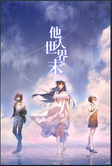

<h1>写在之前</h1>

**先放商店链接**

[他人世界末](https://store.steampowered.com/app/1225780/_Onlooker/)

写下这些文字时，我已经全通所有线，回收结局完毕。我一贯是一个看剧情很慢的人，所以这次花了31个小时全通 悲
我是一个很喜欢根据第一印象来选择自己想要通关的线的人，因此这次不锁剧情线可以说体验很好然后在回收结局时吃了一地的玻璃渣
但总得来说，这还是第一款让我全通后，耐下心来写长评的游戏。

---
<h2>以下部分含有部分剧透</h2>

顺便也说一下我在玩游戏时选择的路线，第一条我就选择了沈岩线，手贱在第一个选项，也是饱受诟病的叫室友那儿，选了叫他去上课，虽然初见直接选了不想但是忘了load回去剁手剁手
尽管后来根据推理选择了全为加好感的选项，但还是进了不留END直到现在还被不留恶心到了，但是也算是第一次初见就进了沈岩线TE吧大概
第二条木竹樱线，这次更绝，我也不知道哪里莫名奇妙，在哪里选了一个选项没load，但是却阴差阳错进到了TE,甚至我还不知道这是TE,毕竟太过悲伤，两人终究错过。
然后第三条就是赵诗线，这条我吸取教训，干脆不load，可大概是不对拍的人始终不对拍，这次我没像前2条线一样能够全对，可是却反而进入了TE，漫长道别。

回顾一下我这初见的三条线，都是阴差阳错，都是第一遍就进入到了TE(我始终认为我第一次玩沈岩线应该进TE)认真脸.jpg。
下面我也针对不同线来讲讲我在回收完结局后的感想。
另外说一下我是通关一条线的TE后，回收这条线所有结局，该条线全部结局回收后我才进入下一条线。

<h2>沈岩线</h2>

这条是我第一条打通的线， 是的，我选择性无视了作者的建议直接进沈岩线，分别来谈谈他们的结局吧。
首先BE，成人法则
成人法则在我回收结局时，感受到的，就是深深的无力感，命运弄人，但是这一切又能怪谁呢？大概这就是成人的法则，无力，想要反抗，后悔，但是这确实是自己走的路，也只能作为一个成人接受这一切。
而第二个，也是诟病最多的NE,不留，老实说，作为我真正意义上进入的第一个结局，我只感觉到了，命运的嘲弄，彻彻底底的嘲弄，以及深深的恶意，一个人的改变是如此的简单，一个人想走，一个人想留的爱情里，想留的人是多么卑微。
最后的TE，沙之书，应了成就的那句话，不是命运把我推回了你的身边，而是我自己走了过来。在TE里，不仅完成了对于序章的叙述收束，同时在最后的结局了里袁季遥救赎了沈岩，拯救了她，使得她摆脱了儿时的噩梦，回到了现在，好好面对明天。而沈岩，也在结局，完成了对袁季遥的救赎，在他取回自己的真我后，能够勇于迈入人生的下一个阶段。
这也是我认为的，这游戏里面的唯一TE.

<h2>木竹樱线</h2>

这条，则是我第二条打通的线。这里只谈TE 邮差，因为我认为GE Stargazer 从某种意义上，算是一种妥协，因为我认为，这已经不是做为弟弟的袁季遥能做的事了，只有在沈岩线中，拿回了自己的人格，完成了自我的救赎的袁季遥才能选择的路，因此，也是不可能出现在木竹樱线的一个结局，因为在这里，袁季遥在最后，也只是一个作为弟弟的袁季遥。邮差，结局意为对于理想主义者而言哪里都是坟墓。起初我打出邮差结局，还很奇怪，为什么明明不是好感度要求最高的结局，却是TE。可后来在继续体会剧情中，想起了作者提到的十三个结局，都体验过才算完整，突然明白了作者这么设计的理由，也只有那个，沈岩线中的袁季遥，完成了自我救赎的袁季遥才能真正的有勇气，在最后的邮差中，踏着十二点的钟声，对那个在大雪中瑟瑟发抖的女孩坚定的说“这次是我来晚了，为了赔罪，我们一起走回家吧”。而作为邮差中的那个，只能是弟弟的袁季遥，只会感叹两人之间的鸿沟之大，踌躇犹豫，被自己的臆想所打败，没能完成最后一个约定，选择了逃跑，我想这也是为什么，两人遗憾的结局反而却成为了TE的原因。

<h2>赵诗线</h2>

这条，是我最后一条通关的线。同样只讲TE 漫长道别。或许是始终跟赵诗对不上，我这次就没有之前那样，选项全对，而是在共通线错了几个，可是意想不到的，这条线我也进了TE。有了木竹樱的TE的感悟，这里我感受到的，就是深深的伤害，同样是一个想走，一个强留，最后伤害了彼此。HE的拿起名片也更像是作者的一种施舍，因为整条线结束，我只是看出了大大的不配，一切都是男主自找的，这大概也是我感觉最憋屈的TE。当断不断，必受其乱，正如剧情中的那句话，对所有人都温柔善良的袁季遥却是对赵诗最残忍的人。这大概就是整条赵诗线想表达的，你所有做的一切，对于一个不爱你的人眼中，都是滑稽万分，所有的一厢情愿付出，都不过是自我感动。
大写的卑微莫过如此

<h2>最后的总结</h2>

13个结局，十三种体验。确实，我在完完全全通完13个结局后，从开始对木竹樱邮差结局是TE的不解，到最后的释然。十三个结局，十三种人生，在经历一切后，我明白了为什么作者说NE,BE更切合作品。我认为，其他两条线的HE，都是建立在袁季遥能真正取回自己，才能达到的结局，也就是，不可能出现的HE,妥协的HE。而木竹樱，赵诗这两条线的NE,TE，同时也包括沈岩线的NE,BE才是袁季遥所要面对的人生百态。最感慨万千也是最早通关的沈岩线TE，这条线中作者完成了伏笔回收，剧情铺垫，情感升华，这个TE也是我认为这三条线里唯一的TE，只有这条线，男主取回了自己，打碎了自己的始终作为一个旁观者的世界，与沈岩相伴，两个人携手一起真正的踏入各自人生的下一篇章。最后，结局也回答了开篇的神女究竟是谁的额问题，其实神女是谁，真的有意义么？沉溺于过去，不正如男主一样，迷失自我，纠结于命中注定，在原地踏步，踌躇不前，始终活在过去。不如脚踏实地，与眼前人一起，共同前往人生的新篇章，正如袁季遥找到了沈岩，沈岩也找到了袁季遥一般。看到这里也感谢你能听我絮絮叨叨这些，最后的最后，就用ED的结尾文字，送给你

愿每一个你，都能在这个世界里找到属于自己的容身之所

发布于 7月26日。 最后编辑于 7月26日。
